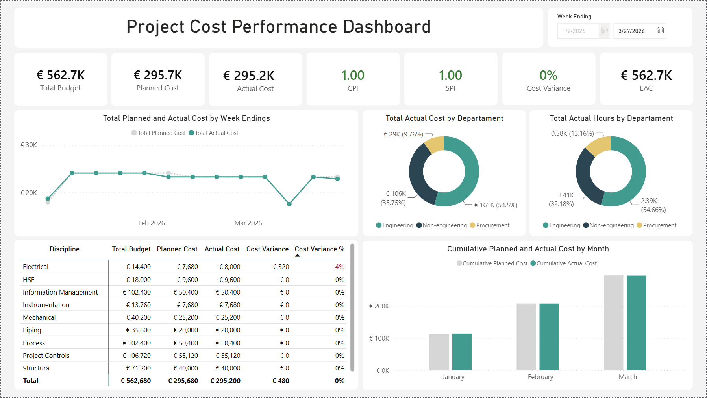
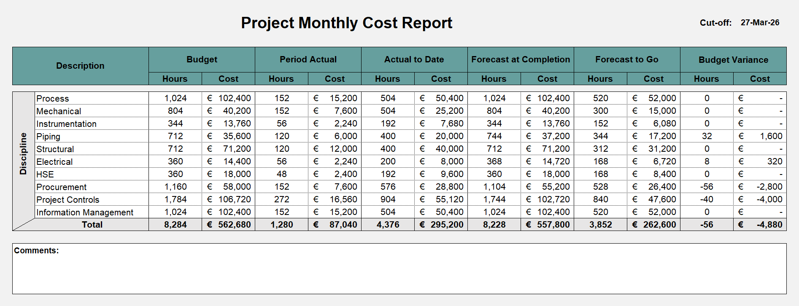
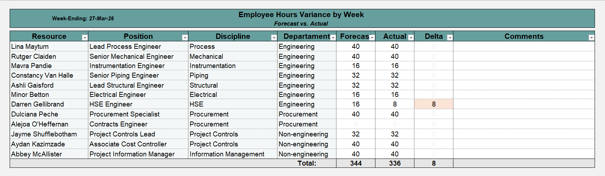

# Project Cost Control & Performance Reporting System

An integrated Excel and Power BI solution developed to support project cost control, resource planning, forecasting, and performance reporting. Inspired by engineering project workflows, this portfolio demonstrates how project data can be transformed into structured operational reports and interactive management dashboards.

---

# Project Objectives

This project was developed to demonstrate practical Project Controls workflows commonly used within engineering and Oil & Gas projects, including:

- Resource Management Planning (RMP)
- Weekly & Monthly Cost Reporting
- Planned vs Actual Cost Analysis
- Forecasting & Budget Control
- Employee Hours Variance Tracking
- Earned Value Management (EVM)
- Interactive Executive Reporting using Power BI

---

# System Architecture

```
                     Project Cost Control Workbook
                                  │
                                  ▼
                  Resource Management Plan (RMP)
                                  │
          ┌───────────────────────┼────────────────────────┐
          │                       │                        │
          ▼                       ▼                        ▼
 Monthly Cost Report     Employee Hours Variance     Power BI Dashboard
   (Management)          (Operational Tracking)    (Performance Reporting)
```

The **Resource Management Plan (RMP)** serves as the central data source of the reporting system. It stores project resource information, planned hours, actual hours, forecast hours, employee rates, and cost data that feeds all reporting outputs.

From this single source, the workbook automatically generates:

- **Monthly Cost Report** for project monthly cost monitoring and forecasting.
- **Employee Hours Variance Report** for weekly resource tracking.
- **Power BI Dashboard** for interactive project performance reporting and Earned Value Management (EVM) analysis.

---

# Power BI Dashboard

The Power BI dashboard provides an interactive overview of project cost performance, forecasting, and Earned Value Management metrics, allowing project managers and stakeholders to monitor project health in real time.



## Dashboard Features

### Executive KPIs

- Total Budget
- Planned Cost
- Actual Cost
- Cost Variance
- Cost Performance Index (CPI)
- Schedule Performance Index (SPI)
- Estimate at Completion (EAC)

### Performance Reporting

- Weekly Planned vs Actual Cost Trend
- Department Cost Distribution
- Department Hours Distribution
- Monthly Cumulative Cost Comparison
- Discipline Cost Summary
- Interactive Date Slicer
- Dynamic Cross Filtering
- Conditional Formatting for Variance Analysis

### Data Model

- Calendar Dimension
- Cost Fact Table
- Hours Fact Table
- Discipline Dimension
- Custom DAX Measures

---

# Excel Cost Control Workbook

The Excel workbook functions as the operational reporting system used to manage project resources, monitor project costs, and support forecasting activities.

Unlike the Power BI dashboard, which focuses on visualization, the workbook performs the core reporting calculations and serves as the primary source for project reporting.

---

## 1. Resource Management Plan (RMP)

The Resource Management Plan is the central planning dataset of the reporting system.

It supports:

- Employee Information
- Discipline & Position Planning
- Weekly and Monthly Planned, Forecast, and Actual Hours & Costs
- Employee Billing Rates

---

## 2. Monthly Cost Report

The Monthly Cost Report provides discipline-level financial reporting and forecasting.

The report automatically calculates:

- Budget
- Period Actual
- Actual To Date
- Forecast At Completion (FAC)
- Forecast To Go (FTG)
- Budget Variance

Reporting is driven by a configurable reporting cut-off date, allowing the workbook to update automatically for different reporting periods.



---

## 3. Employee Hours Variance Report

This report monitors weekly employee bookings by comparing Forecast Hours against Actual Hours.

The report provides an early warning mechanism for:

- Over-booking
- Under-booking
- Missing Timesheets
- Resource Planning Issues

Weekly comments can also be recorded to explain significant booking variances.



---

# Excel Features

The workbook utilizes advanced Excel functionality, including:

- SUMPRODUCT
- SUMIFS
- XLOOKUP
- SUBTOTAL
- Conditional Formatting
- Cross-sheet Formula Logic
- Data Validation (drop-down selectors and input controls)

The reporting system was designed to minimize manual work, preserve historical data, and simplify recurring monthly reporting.

---

# Power BI Features

The dashboard was developed using:

- Power Query
- Data Cleaning & Transformation
- Data Modeling
- DAX Measures
- Custom Calendar Table
- Interactive Filtering
- KPI Cards
- Matrix Visuals
- Line Charts
- Donut Charts

---

# Earned Value Management (EVM)

The dashboard includes key Earned Value Management metrics, including:

- Earned Value (EV)
- Actual Cost (AC)
- Cost Performance Index (CPI)
- Schedule Performance Index (SPI)
- Estimate at Completion (EAC)

> **Note:** Since the sample dataset does not include activity-level physical progress, Earned Value (EV) was estimated using project cost progress for demonstration purposes. In a live project environment, EV would typically be calculated from schedule or physical progress data provided by the planning team.

---

# Design Philosophy

The reporting system was designed around practical Project Controls principles rather than simply demonstrating Excel or Power BI functionality.

Key design decisions include:

- Maintain the contractual plan as the project baseline.
- Preserve historical reporting by adding records instead of modifying or deleting existing ones.
- Use the Resource Management Plan (RMP) as the single source of truth for all reporting.
- Separate operational reporting from executive dashboards.
- Simplify recurring monthly reporting through automation.
- Build reports that are transparent, auditable, and easy to maintain.

---

# Repository Structure

```
Project-Cost-Control-System/

│── Project Cost Performance Dashboard.pbix
│── Project Cost Control Workbook.xlsx
│── README.md
│
└── Images/
     ├── powerbi_dashboard.png
     ├── excel_monthly_cost_report.png
     └── excel_weekly_variance.png
```

---

# Skills Demonstrated

- Project Controls
- Cost Control
- Resource Planning
- Cost Forecasting
- Earned Value Management (EVM)
- Variance Analysis
- Project Reporting
- Microsoft Excel
- Power BI
- Power Query
- DAX
- Data Modeling
- Dashboard Development
- Financial Reporting
- Engineering Project Reporting

---

# About This Project

This repository was developed as part of my professional portfolio to demonstrate practical Project Controls, Cost Control, Excel, and Power BI skills.

The project is inspired by reporting processes commonly used in engineering and Oil & Gas projects and combines an Excel-based cost control workbook with an interactive Power BI dashboard to support resource planning, forecasting, cost reporting, and project performance analysis.

# Data Privacy & Disclaimer

All financial figures, employee names, and project metrics used in this project are mock/synthetic data created strictly for demonstration and portfolio purposes. No proprietary or confidential corporate data was used.
